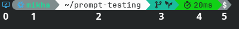

# Bash Module
This module configures bash. Importing it into home manager will enable bash with the following options and additional functionality.

> [!Note]
> Be aware that a nerd font is required to see all icons in the prompt. JetBrains Mono Nerd Font can be included by importing `modules/nixos/system/fonts.nix` in your system configuration.

## Readline & shell configuration
- Press Tab to autocomplete file names and commands, and cycle through options with repeated presses
- Ignore case when autocompleting
- Use ↑ to search backwards through your history for the text in the prompt
- Use ↓ to search forwards through your history for the text in the prompt
- Do not print out control characters in a visible format (e.g. ^C)
- Sync bash history across all open terminals on each command
- Don't store duplicate entries in bash history
- When tab completing in the middle of a word, move the cursor past the completed text instead of inserting the completed text at the cursor position (pressing tab with your cursor after the `u` in `cd modules` will move your cursor to the end instead of changing it to `cd modulesles`)
- Set the terminal cursor to a blinking bar

### Key Bindings

| Keybind | Action |
|---------|--------|
| <kbd>Ctrl</kbd> + <kbd>Backspace</kbd> | Delete the last word behind the cursor |
| <kbd>Alt</kbd> + <kbd>←</kbd> | Go up one directory (`cd ..`) |
| <kbd>Alt</kbd> + <kbd>→</kbd> | Go to the previous directory (`cd -`) |
| <kbd>Alt</kbd> + <kbd>S</kbd> | Prepend `sudo` to the current command |
| <kbd>Ctrl</kbd> + <kbd>R</kbd> | Reload the bashrc file from `~/nix/modules/home-manager/bash/bash.rc` |

## Custom nix options

### Cursor Configuration
- `cursor.shape`: set the cursor shape - "block", "underline", or "bar" (default is "bar").
- `cursor.blink`: enable cursor blinking (default is true).

### Prompt Indicators
- `prompt.indicator.ssh.enable`: show an indicator when connected via SSH (default is true).
- `prompt.indicator.ssh.color`: hex color of the SSH indicator (default is "#3DAEE9").
- `prompt.indicator.nixShell.enable`: show a nix snowflake icon when inside a nix-shell (default is true).
- `prompt.indicator.nixShell.color`: hex color of the nix-shell indicator (default is "#7EB7E2").
- `prompt.indicator.nixShell.pureColor`: hex color of the leaf icon indicating a pure nix shell (default is "#9FE27E").

### Prompt Sections
Each section can be individually enabled/disabled and customized:

#### System Section
- `prompt.section.system.enable`: show system information in the prompt (default is true).
- `prompt.section.system.distroIcon`: show the distro icon (default is true).
- `prompt.section.system.user`: show the username (default is true).
- `prompt.section.system.host`: show the hostname (default is false).
- `prompt.section.system.color`: hex color of the system section text (default is "#7ED9D9").
- `prompt.section.system.background`: hex background color of the system section (default is "#666").
- `prompt.section.system.precedence`: sorting priority this section in the prompt (default is 0).

#### Directory Section
- `prompt.section.directory.enable`: show the current directory (default is true).
- `prompt.section.directory.abridged`: use concise directory display with icons and truncation (default is true).
- `prompt.section.directory.color`: hex color of the directory section text (default is "#000").
- `prompt.section.directory.background`: hex background color of the directory section (default is "#FFF").
- `prompt.section.directory.precedence`: sorting priority this section in the prompt (default is 1).
- `prompt.section.directory.icons`: a map of directory names to icons to use when in their sub directories. Any icons specified in this map will be merged with the default set of icons.

#### Git Branch Section
- `prompt.section.gitBranch.enable`: show the current git branch and commits ahead/behind (default is true).
- `prompt.section.gitBranch.statusSummary`: show a summary of git status next to the branch name (default is true, automatically disabled if gitStatus is enabled).
- `prompt.section.gitBranch.color`: hex color of the git branch section text (default is "#000").
- `prompt.section.gitBranch.background`: hex background color of the git branch section (default is "#1497B8").
- `prompt.section.gitBranch.precedence`: sorting priority this section in the prompt (default is 2).

#### Git Status Section
- `prompt.section.gitStatus.enable`: show detailed git status (modified/untracked files) (default is true).
- `prompt.section.gitStatus.color`: hex color of the git status section text (default is "#000").
- `prompt.section.gitStatus.background`: hex background color of the git status section (default is "#1481B8").
- `prompt.section.gitStatus.precedence`: sorting priority this section in the prompt (default is 3).

#### Timer Section
- `prompt.section.timer.enable`: show command execution time and exit status (default is true).
- `prompt.section.timer.success.color`: hex color when command succeeded (default is "#000").
- `prompt.section.timer.success.background`: hex background color when command succeeded (default is "#14B879").
- `prompt.section.timer.failure.color`: hex color when command failed (default is "#FFF").
- `prompt.section.timer.failure.background`: hex background color when command failed (default is "#CD3131").
- `prompt.section.timer.warning.color`: hex color when command was interrupted (default is "#000").
- `prompt.section.timer.warning.background`: hex background color when command was interrupted (default is "#CCA633").
- `prompt.section.timer.precedence`: sorting priority this section in the prompt (default is 4).

#### Privilege Section
- `prompt.section.privilege.enable`: show privilege symbol (# for root, $ for user) (default is true).
- `prompt.section.privilege.color`: hex color of the privilege symbol (default is "#FFF").
- `prompt.section.privilege.background`: hex background color of the privilege symbol (default is "#666").
- `prompt.section.privilege.precedence`: sorting priority this section in the prompt (default is 5).

### Prompt Icons
- `prompt.icons.start`: icon to use at the start of the prompt (default is "").
- `prompt.icons.end`: icon to use at the end of the prompt (default is "").
- `prompt.icons.sep`: icon to use as separator between sections (default is "").

### Extra Lines
- `bash.extra`: list of extra lines appended to the end of the generated bashrc (after all module content). Each item becomes its own line.

### Completion scripts
- `bash.completions`: attribute set of completion script paths. Each key is the name of the completion script, and the value is the path to the script. These scripts get added to `$XDG_DATA_HOME/bash-completion/completions/` and are automatically sourced.

## Extra Functionality
- cd accepts any number of `.`s after `..` to go up additional directories (e.g. `cd ...` goes up 2 directories, `cd ....` goes up 3, etc).
- using cd to change directory into a dir with a python virtual environment (.venv) will automatically activate the venv. Leaving the directory will deactivate it. Changing into a subdir of a venv dir will also activate the venv in the parent dir if it was not already active.

## Prompt Customization
The bash prompt has 6 sections. If a section is not applicable, it is omitted. The sections are as follows:

#### 0: Environment
This section shows before the prompt and indicates if you are in a special environment. It can show any combination of the following:
- A blue 󰢹 (remote desktop icon) if you are in an SSH shell.
- A light blue  (nix snowflake) if you are in a nix shell, followed by a green 󰌪 (leaf) if you are in a pure nix shell (`--pure`).

#### 1: OS Distribution and User
This section shows the OS distribution icon and your username. The icon works for debian, nixos, ubuntu and termux (android).

#### 2: Current Directory
This section shows the current directory, which is be abbreviated for long paths.

- The current user's home directory is abbreviated as `~`.
- Directories with specific names in the home directory and the `/` directory are replaced with icons when you are within their sub directories (if you are in a dir with an icon but not in one of it's sub dirs it's name will not be replaced by an icon). Desktop, Documents, Downloads, Music, Pictures etc. are all examples of directories that have icons. You can find the full list in the `bash.rc` file in this module (see `DIR_ICONS`).
- If more than 1 directory deep in the current users home directory or `/`, the path is abbreviated to show `…/<current-dir>` for brevity. If the root directory in `~` or `/` is a directory with an icon, it will be `<icon>/…/<current-dir>`, and will only truncate when you are more than 2 directories deep. 
	 
	In the example above the user is several directories deep in the Documents dir in their home directory, in a dir called Personal.

#### 3: Git Status
This section shows the current git branch and status if you are in a git repository.
- If you are in a new repo with no commits, it will show  (new shoot icon). You can see an example of this in the first image of the [Prompt Customization](#prompt-customization) section.
- If you are on a branch, it will show the branch name.
- If you are in a detached head state, it will show   followed by the short commit hash.
- If there are commits that have not been pushed to the remote, it will show ↑, followed by the number of commits.
- If there are commits that have not been pulled from the remote, it will show ↓, followed by the number of commits.

#### 4: Command Duration & Exit Status
This section shows the duration of the last command down to the millisecond. The units go up to days. The color of this section changes based on the exit status of the previous command:
- green for 0 (success)
- yellow for 130 (Ctrl + C)
- red for everything else.

#### 5: Prompt Symbol
This section shows a `$` for normal users and a `#` for root.

## Aliases
The following aliases are included by default:
| Alias | Command | Description |
|-------|---------|-------------|
| `cls` | `clear` | Clear the terminal |
| `wifi` | `nmcli device wifi show-password` | Print the current wifi SSID, password and a QR code to join it |
| `myip` | `echo $(curl -s ifconfig.me)` | Print public IP address |

## Extra Resources
- [Color codes & how to use them](https://en.wikipedia.org/wiki/ANSI_escape_code#Colors)
- [Readline options (arch wiki)](https://wiki.archlinux.org/title/Readline)
- [All readline options](https://www.gnu.org/software/bash/manual/html_node/Bindable-Readline-Commands.html)
- [Bash reference manual](https://www.gnu.org/savannah-checkouts/gnu/bash/manual/bash.html#Bash-Variables)
- [List of programs that support XDG dirs](https://wiki.archlinux.org/title/XDG_Base_Directory)
- [Controlling the bash prompt](https://www.gnu.org/software/bash/manual/html_node/Controlling-the-Prompt.html)

### potential future additions
- [ble.sh](https://github.com/akinomyoga/ble.sh)
- [zoxide](https://github.com/ajeetdsouza/zoxide)