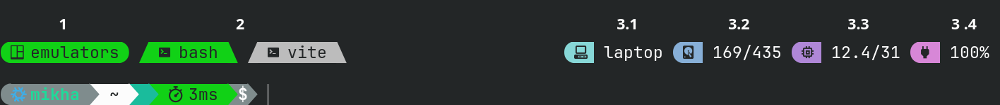

# Tmux Module
This module configures tmux. Importing it into home manager will enable tmux with the following options and additional functionality. All additional functionality is provided by my own scripts. This tmux setup does not depend on any external plugins.

> [!Note]
> Be aware that a nerd font is required to see all icons in the prompt. JetBrains Mono Nerd Font can be included by importing `modules/nixos/system/fonts.nix` in your system configuration.

## Options
- Mouse support is enabled
- The base index of windows and panes is set to 1 for easier keyboard navigation
- Key mode is set to `vi`
- Confirmation for killing a window is disabled
- Tmux message display time is set to 4 seconds from (.75s)

### Key Bindings
| Keybind | Action |
|---------|--------|
| <kbd>Prefix</kbd> + <kbd>R</kbd> | Reload the tmux configuration file |
| <kbd>Ctrl</kbd> + <kbd>Tab</kbd> | Switch to the next window |
| <kbd>Ctrl</kbd> + <kbd>Shift</kbd> + <kbd>Tab</kbd> | Switch to the previous window |
| <kbd>Prefix</kbd> + <kbd>\|</kbd> | Split the window vertically (Replaces <kbd>Prefix</kbd> + <kbd>%</kbd>) |
| <kbd>Prefix</kbd> + <kbd>-</kbd> | Split the window horizontally (Replaces <kbd>Prefix</kbd> + <kbd>"</kbd>) |
| <kbd>Ctrl</kbd> + <kbd>w</kbd> | Detach from the current tmux session |

## Custom nix options
- `autoAttach.enable`: automatically attach to a tmux session called `autoAttach.defaultSessionName` when starting a terminal. If no session exists, a new one will be created with the name specified by `autoAttach.defaultSessionName`.
- `autoAttach.defaultSessionName`: the name of the tmux session to attach to or create (default is the hostname of the machine).
- `autoAttach.sshOnly`: only auto attach when connecting over SSH (default is false).
- `motd`: set a custom message to display at the top of new tmux windows.
- `prefix`: change the prefix key (default is <kbd>Ctrl + B</kbd>).
- `selection.background`: change the background color of selected text in copy mode (default is "#99CCE6").
- `selection.color`: change the foreground color of selected text in copy mode (default is "#000").
- `message.duration`: set the duration (in milliseconds) for which tmux messages are displayed (default is 4000).
- `message.color`: change the foreground color of tmux messages (default is "#000").
- `message.background`: change the background color of tmux messages (default is "#D9AD8C").
- `prompt.color`: change the text color of the session pill and active tab (default is "#000").
- `prompt.background`: change the background color of the session pill and active tab (default is the classic tmux green).
- `prompt.info`: toggle system info in the status bar. See [status bar customization](#status-bar-customization) for details.
- `tat`: enable Tmux ATtach (tat) script for easier session management. See [Tmux Attach (tat)](#tmux-attach-tat) for details.

## Status Bar Customization
The status bar has been placed at the top of the window with an empty line below it and has 3 general sections.

#### 1: Session Name
This section shows the current tmux session name with a tmux icon before it.

#### 2: Window List
This section shows the list of windows in the current session, styled to look like tabs. The current window is highlighted in the colors specified by `prompt.color` and `prompt.background` (defaults are black text on the classic tmux green background).

#### 3: System Info
This section can be configured to show various system information, provided by custom scripts included by this module should they be enabled.

The `prompt.info` option can be set to:
- `true` to enable all info sections
- `false` to disable all info sections
- An attribute set to configure individual sections

Each info section can be individually configured with its own colors:

##### 3.1 Host
This shows the hostname of the current machine with a computer icon before it. It can be toggled with `tmux.prompt.info.host.enable` and is enabled by default. Colors can be customized with `tmux.prompt.info.host.color` (default "#000") and `tmux.prompt.info.host.background` (default "#99CCE6").

##### 3.2 Disk
This shows the disk usage of the root filesystem with a hard drive icon before it. It can be toggled with `tmux.prompt.info.disk.enable` and is enabled by default. Colors can be customized with `tmux.prompt.info.disk.color` (default "#000") and `tmux.prompt.info.disk.background` (default "#999FE5").

##### 3.3 Memory
This shows the current memory usage with a CPU icon before it (the memory icon is too large). It can be toggled with `tmux.prompt.info.memory.enable` and is enabled by default. Colors can be customized with `tmux.prompt.info.memory.color` (default "#000") and `tmux.prompt.info.memory.background` (default "#BF99E5").

##### 3.4 Battery
This shows the current battery percentage with a battery icon before it. It can be toggled with `tmux.prompt.info.battery.enable` and is enabled by default. Colors can be customized with `tmux.prompt.info.battery.color` (default "#000") and `tmux.prompt.info.battery.background` (default "#E599DF").
The icon is a filled battery, filled to the % the battery is currently charged to in increments of 10. If the laptop is plugged in and charging it will display a lightning bolt next to it. If it is fully charged and plugged in, or plugged in not charging it will show a plug icon instead.

## Tmux Attach (tat)
`tat` is an application that improves navigation between tmux sessions.

See the [readme](https://github.com/MikhaD/nix-config/tree/main/pkgs/tat) for more information.