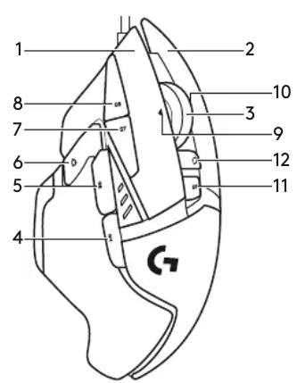

# KeyD Module
This module configures the keyd service for system-wide keyboard remapping. Importing it into your nixos configuration will enable keyd with the following functionality.

### Key Mappings
| Keybind | Action | Reasoning |
|---------|--------|-----------|
| <kbd>CapsLock</kbd> | <kbd>Shift</kbd> | The majority of the times I press CapsLock I was trying to hit shift and got it by accident. |
| <kbd>Ctrl</kbd> + <kbd>CapsLock</kbd> | <kbd>CapsLock</kbd> | If I do want to use CapsLock, I can hold Ctrl and press it, making it much harder to do by accident. |
| <kbd>Insert</kbd> | <kbd>Backspace</kbd> | The majority of the times I press Insert I was trying to hit Backspace and got it by accident. |
| <kbd>Ctrl</kbd> + <kbd>Insert</kbd> | <kbd>Insert</kbd> | If I do want to use Insert, I can hold Ctrl and press it, making it much harder to do by accident. |
| <kbd>F20</kbd> | <kbd>Alt</kbd> | F20 is mouse button 11 on my mouse, which is at the top of the mouse behind the scroll wheel lock. |
| <kbd>F23</kbd> | <kbd>Ctrl</kbd> | F23 is mouse button 6 on my mouse, which is on the side of the mouse where my thumb rests. |
| <kbd>F24</kbd> | <kbd>Shift</kbd> | F24 is mouse button 5 on my mouse, which is on the side of the mouse above where my thumb rests. |

